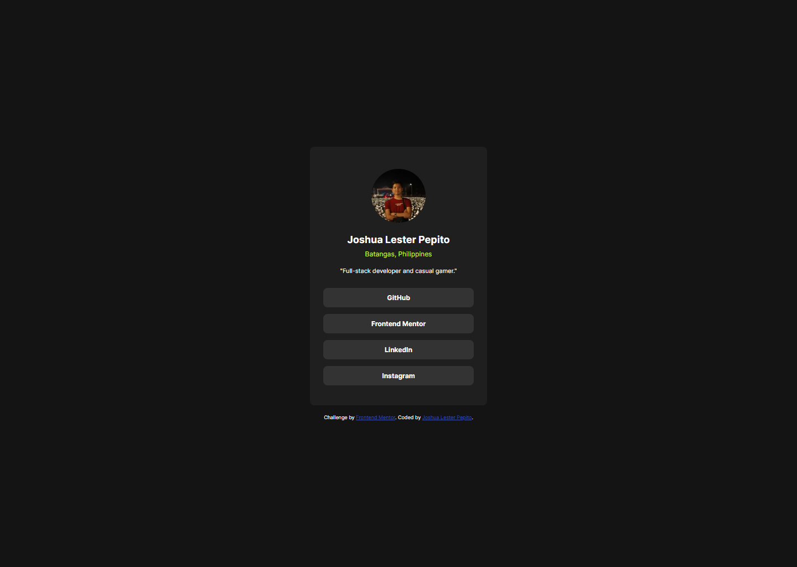
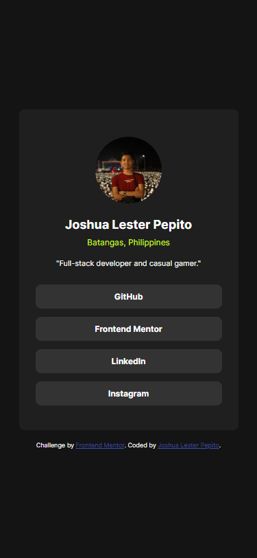

# Frontend Mentor - Social links profile solution

This is a solution to the [Social links profile challenge on Frontend Mentor](https://www.frontendmentor.io/challenges/social-links-profile-UG32l9m6dQ). Frontend Mentor challenges help you improve your coding skills by building realistic projects. 

## Table of contents

- [Overview](#overview)
  - [The challenge](#the-challenge)
  - [Screenshot](#screenshot)
  - [Links](#links)
- [My process](#my-process)
  - [Built with](#built-with)
  - [What I learned](#what-i-learned)
  - [Continued development](#continued-development)
- [Author](#author)

**Note: Delete this note and update the table of contents based on what sections you keep.**

## Overview

### The challenge

Users should be able to:

- See hover and focus states for all interactive elements on the page

### Screenshot

Desktop view(1440x1024)

Mobile view(375x812)

### Links

- Solution URL: [Add solution URL here](https://your-solution-url.com)
- Live Site URL: [Add live site URL here](https://your-live-site-url.com)

## My process

### Built with

- Semantic HTML5 markup
- Vanilla CSS styling
- Mobile-first workflow

### What I learned

I've got a refresher on how to properly use display properties like flex, block, etc., without using pre-existing classes from CSS framework like Tailwind or Bootstrap

### Continued development

I would like to continue on honing my front-end skills and eventually taking on more challenging exercises

## Author

- LinkedIn - [Add your name here](https://www.linkedin.com/in/joshua-lester-pepito)
- Frontend Mentor - [@yourusername](https://www.frontendmentor.io/profile/jasterpepito11)

